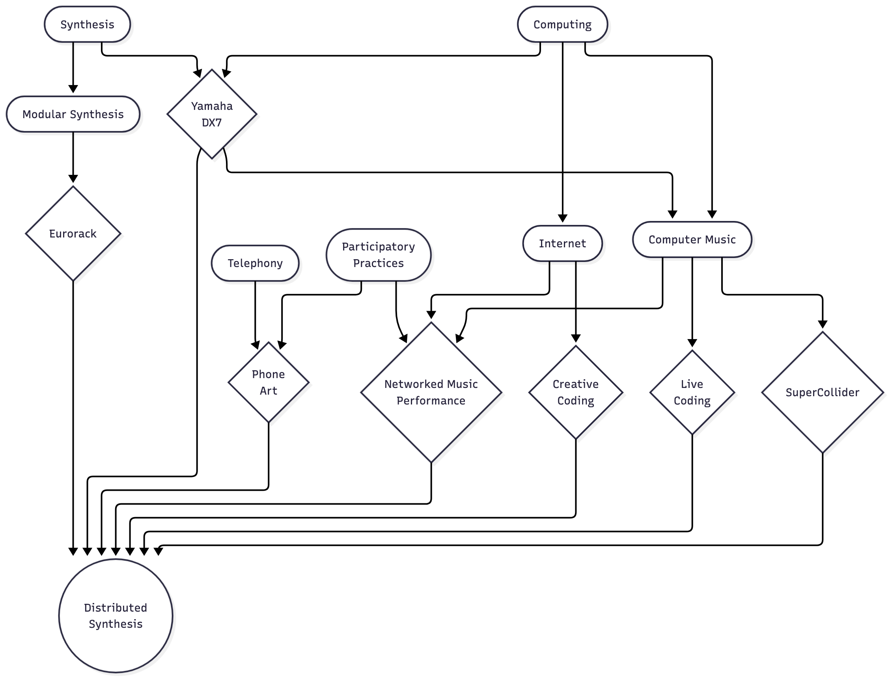
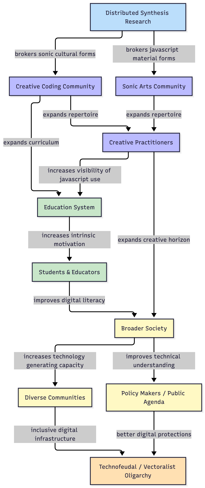

<!--The rationale, objectives and research questions you plan to focus on -->
# Rationale

The rationale is tripartite, with the three categories being *creative*, *pedagogical*, and *sociological*.

## Creative Rationale
To fashion a coalition of cultural and technical scaffolding such that the connective, computational, and transductive affordances of audiences' devices may be leveraged to increase the accessability of networked music performance and multi-channel sonic works.

## Pedagogical Rationale
The pedagogical rational pivots on the project's ability to scaffold cultural practices which foreground the creative control of information vectors through the infrastructure of the internet.  The logic is that by making these practices more vivid in students' cultural life-worlds, the project operates at the level of sense of belonging and identity psychology to increase students' intrinsic motivations to learn the specific digital literacies required by this repertoire.

## Sociological Rationale
- To pry open a space for play in the tightly woven normative strictures that characterises our relation to our phones.
- To help, via its *pedagogical effects*, a) cultivate a more digitally literate citizenry capable of holding public discourse to a higher level of technical sophistication; and b) increase the technology-generating capacity of diverse communities.

\pagebreak{}

<!--An explanation of how your research is situated in the context of your discipline or community of practice -->
# Research Situation

My sonic practice of distributed synthesis inherits from a variety of cultural lineages -- see *figure 1*.  Particular importance is placed on:

- the pioneering work of Chowning in developing frequency modulation synthesis, and which led to the production of the highly impactful Yamaha DX7. [-@chowningSynthesisComplexAudio1977]
- SuperCollider -- an open source programming language and environment for digital signal processing and algorithmic composition, founded by McCartney. [-@mccartneyRethinkingComputerMusic2002]
- TidalCycles, and the efforts of McLean [-@mcleanOxfordHandbookAlgorithmic2018], Cox [-@coxSpeakingCodeCoding2013], Blackwell [-@blackwellCollaborationLearningLive2014; -@blackwellLiveCodingUsers2022], Collins [-@collinsLiveCodingLaptop2003], et al. in establishing a world-wide community of practice for live coding.
- the esablishment of the Eurorack standard for modular synthesis in the mid 90s, and the community of practice which has grown around it since then [@jenkinsAnalogSynthesizersUnderstanding2020; @bjornPatchTweakExploring2018]
- the efforts of Maeda [-@maedaDesignNumbers1999; -@maedaCreativeCode2004], Reas & Fry [-@reasProcessingProgrammingHandbook2007; -@reasModernPrometheus2018], Shiffman [-@shiffmanLearningProcessingBeginners2015; -@shiffmanNatureCodeSimulating2024], McCarthy [-@mccarthyYouMeMy2020; -@mccarthyMakingSpaceFuture2019; -@mccarthyP5js10Here2020; -@mccarthyMakeGettingStarted2015; -@mccarthyCreatingArtOpen2018], Tarakajian [-@tarakajianP5jsWebEditor2020, -@tarakajianAccessibilityImprovementsP5js2020], et al. in establishing a world-wide community of practice for creative coding
- the array of thinkers and practitioners who have, over the years, attempted to investigate, understand, and agitate our entangled relation to the telephone [@mcluhanUnderstandingMediaExtensions1994; @ronellTelephoneBookTechnology1989; @kittlerDiscourseNetworks18001990; @dolarVoiceNothingMore2006]
- the

\pagebreak{}

<!--Updated methodology (how you will undertake the proposed project) -->
# Methodology

- Mycelial Creativity
- Iterative Design
- Diffractive Reading

<!--Updated review of literature and references including a list of key readings and references -->
# Key Readings
- Pink Noises [@rodgersPinkNoisesWomen2010]
- Social Dissonance [@mattinSocialDissonance2022]

<!--Updated outline/summary of your progress against your research plan -->
# Progress
- cicade.assembly.fm
- string.assembly.fm
- voice.assembly.fm

<!--A summary of any changes to your candidature since your Confirmation of Candidature.-->
# Changes
- more orientated towards original work

\pagebreak{}

## References
