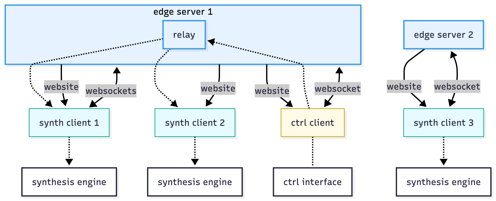

\pagebreak{}

<!--The rationale, objectives and research questions you plan to focus on -->
# Rationale

The rationale is tripartite, with the three categories being *creative*, *pedagogical*, and *sociological*.

## Creative Rationale
To fashion a coalition of cultural and technical scaffolding such that the connective, computational, and transductive affordances of audiences' devices may be leveraged to increase the accessability of networked music performance and multi-channel sonic works.

## Pedagogical Rationale
The pedagogical rational pivots on the project's ability to scaffold cultural practices which foreground the creative control of information vectors through the infrastructure of the internet.  The logic is that by making these practices more vivid in students' cultural life-worlds, the project operates at the level of sense of belonging and identity psychology to increase students' intrinsic motivations to learn the specific digital literacies required by this repertoire.

## Sociological Rationale
- To pry open a space for play in the tightly woven normative strictures that characterises our relation to our phones.
- To help, via its *pedagogical effects*, a) cultivate a more digitally literate citizenry capable of holding public discourse to a higher level of technical sophistication; and b) increase the technology-generating capacity of diverse communities.

\pagebreak{}

<!--An explanation of how your research is situated in the context of your discipline or community of practice -->
# Research Situation

##  Genealogy of Practice

My sonic practice of distributed synthesis inherits from a variety of cultural lineages -- see *figure 1*.  Particular importance is placed on:

- the pioneering work of Chowning in developing frequency modulation synthesis, and which led to the production of the highly impactful Yamaha DX7. [-@chowningSynthesisComplexAudio1977]
- SuperCollider -- an open source programming language and environment for digital signal processing and algorithmic composition, founded by McCartney. [-@mccartneyRethinkingComputerMusic2002]
- TidalCycles, and the efforts of McLean [-@mcleanOxfordHandbookAlgorithmic2018], Cox [-@coxSpeakingCodeCoding2013], Blackwell [-@blackwellCollaborationLearningLive2014; -@blackwellLiveCodingUsers2022], Collins [-@collinsLiveCodingLaptop2003], et al. in establishing a world-wide community of practice for live coding.
- the esablishment of the Eurorack standard for modular synthesis in the mid 90s, and the community of practice which has grown around it since then [@jenkinsAnalogSynthesizersUnderstanding2020; @bjornPatchTweakExploring2018]
- the efforts of Maeda [-@maedaDesignNumbers1999; -@maedaCreativeCode2004], Reas & Fry [-@reasProcessingProgrammingHandbook2007; -@reasModernPrometheus2018], Shiffman [-@shiffmanLearningProcessingBeginners2015; -@shiffmanNatureCodeSimulating2024], McCarthy [-@mccarthyYouMeMy2020; -@mccarthyMakingSpaceFuture2019; -@mccarthyP5js10Here2020; -@mccarthyMakeGettingStarted2015; -@mccarthyCreatingArtOpen2018], Tarakajian [-@tarakajianP5jsWebEditor2020, -@tarakajianAccessibilityImprovementsP5js2020], et al. in establishing a world-wide community of practice for creative coding
- the array of thinkers and practitioners who have, over the years, attempted to investigate, understand, and agitate our entangled relation to the telephone [@mcluhanUnderstandingMediaExtensions1994; @ronellTelephoneBookTechnology1989; @kittlerDiscourseNetworks18001990; @dolarVoiceNothingMore2006]
- the lineage of composers, artists, and musicians who have contributed to the set of participatory and networked music performance repertoire.

## Stakeholder Impact

The sets of stakeholders potentially impacted by this research (see *Figure 2*) can be categorised in the same manner as its tripartite rationale (see *Rationale*) -- *creative* (purple), *pedagogical* (green), and *sociological* (yellow).  By brokering repertoire pertaining to cultural forms (co-located music performance rituals) from the sonic arts community of practice (CoP) to the creative coding CoP, and brokering repertoire pertaining to material forms (the browser, javascript, connectivity architectures, etc.) in the other direction, I hope primarily to expand the repertoire available to practitioner members of either CoPs.

This expansion should, secondarily, expand the curricular resources for teachers and curriculm setters in primary, secondary, and tertiary education systems, which, along with increased cultural visibility of javascript use, may increase students' intrinsic motivations to learn those forms of digital literacy.

The effect of this expanded repertoire in the citizens' cultural life-worlds, should be a more ambitious, expanded creative horizon -- we should be able to imagine the feasibility of some things previously understood to be impossible.  This along with improved digital literacy should bolster the technology generating capacities of diverse communities, and increase the technical sophistication of public discourse, politicians, and ultimately, legislation.

\pagebreak{}

<!--Updated methodology (how you will undertake the proposed project) -->
# Methodology

## Diffractive Reading
This research proceeds from a monist disposition, and acknowledges the musical substrate in which discursive participation is predicated, always simultaneously *constructing* the subjective apparatus of intelligibility, and *deploying* it to parse meaning. [@serresInformationThinking2017] This intractable, liquid exchange, between content and context, does not permit a retreat into the invisible view of everything from nowhere, but rather necessitates an ironic, strategic cutting together-apart of theory, concepts, relations, and identities, in the construction of a contingent, fallible, opinionated theoretical position *with an argument*. [@harawaySituatedKnowledgesScience1988; @baradDiffractingDiffractionCutting2014]

The approach finds odd bedfellows with Rorty's *Ironism*, in which he elucidates the absurdity of the concept of a final vocabulary.  [-@rortyContingencyIronySolidarity1989] Truth, for Rorty, can only ever be an attribute of sentences, and as such is therefore relegated to appear and disappear within the confines of our deliberative rituals. [@brandomRortyHisCritics2000]  The role of reading then, is to fit semantic candidates with pragmatic affordances, within a pre-existing network of normative conceptual relations --    in other words, to navigate those commitments that this project must become responsible for (potestas), in order to understand what these responsibilities entitle the project to become (potencia). [@brandomArticulatingReasonsIntroduction2009; @braidottiTheoreticalFrameworkCritical2019]

## Mycelial Creativity

Central to the functioning of this research is the possibility of a mycelial creativity, that is, a way of understanding what creativity *is*, and how it *works*, that draws on the figure of fungal mycelium.[@ingoldTwoReflectionsEcological2004; @clarkePsychologyCreativeProcesses2018]

In this way we can understand creativity to occur as the practitioner accumulates many thousands of individual, specific, transactional relationships with the pragmatic affordances of their cultural, technological, physical, social, digital, institutional, economic, domestic, etc. environments, in an omnidirectional and indiscriminate manner, such that both the practitioner, and their environments, undergo gradual transformation.  [@sheldrakeEntangledLifeHow2020; @tsingMushroomEndWorld2017]  Where the mycelium becomes dense enough, and given the right environmental conditions, a fruiting body grows and releases *spores* -- cultural forms, containing *DNA* -- visible traces of the commitments and processes that constitute the apparatus of their production.

This shifts the locus of creativity from within the encapsulated bounds of human ingenuity, to the distributed, ecological effects of mycelial relations, refocusing the task for creative practitioners, from the heroic scouring or internal resources to find a sublime spark of inspiration, to the much more mundane processes of simply feeling the texture their environs. [@ostendorf-rodriguezLetsBecomeFungal2023; @sedgwickTouchingFeelingAffect2003]

A comparison can be made with design processes that build backwards from deliberately calculated, strategically imagined end result --  mycelial creativity should be understood as a *process* methodology, capable of hosting iterative design cycles, but not requiring them.  Instead, over time, as the mycelium runs and accumulates, should the conditions become favourable, a fruiting body can form almost as from its own accord -- as if from an ecological fugue -- half awake, half dreaming.

As an extreme example, we might spontaneously imagine a Camponotini ant infected with ophiocordycep unilateralis, whose nervous system, now possessed by the fungus, climbs as high into the canopy of the rainforest as possible, before becoming host to the fungus' fruiting body, maximising the area of spore dispersal. [@araujoZombieantFungiContinents2018]  The point here being, not so much that a practitioner should sacrifice their body in service of their creative project, but rather that mycelial creativity works best at a resting state, allowing the practitioner's gut feelings to do the work of processing large quantities of data unconsciously, imprecisely, but massively in parallel, rather than deliberately processing a reduced, potentially incomplete set of data, yes -- more precisely, but much more slowly, via serial, explicit, conscious processes. [@lloydReadingSpinozaAnthropocene2024]  We might recall Freud's image of the dream-wish, rising like a mushroom from the navel of the dream, exactly where the web of unconscious conceptual relations has reached critical density. [-@freudInterpretationDreams2019]

## Iterative Design
At the micro-level, much of my day to day creative methods are governed by the logic of iterative design -- I am defining goals by pairing my understanding of audiences and oppotunities in my cultural environment (as per mycelial creativity), with concepts drawn and fashioned from my diffractive reading.  I brainstorm various approaches and technical affordances, and prototype with those conceptual resources at hand, in a manner that is roughly equivalent with the double diamond design cycle. [@designcouncilDoubleDiamond]

<!--Updated review of literature and references including a list of key readings and references -->
# Key Readings

## Critical Sonic Theory
- Noise: The Political Economy of Music [@attaliNoisePoliticalEconomy1985]
  - in which Attali frames music as a prophetic industry that foretells economic and political reorganisations.
- The Soundscape: Our Sonic Environment and the Tuning of the World [@schaferSoundscapeOurSonic1993]
  - in which Schafer chronicles the modern soundscape to advocate for ecological listening and acoustic responsibility.
- Pink Noises [@rodgersPinkNoisesWomen2010]
  - in which Rodgers assembles interviews foregrounding women's agency in electronic sound cultures.
- One Square Inch of Silence: One Man's Search for Natural Silence in a Noisy World [@hemptonOneSquareInch2010]
  - in which Hempton narrates a quest for natural quiet as a call to protect fragile acoustic ecologies.
- Sound Unseen: Acousmatic Sound in Theory and Practice [@kaneSoundUnseenAcousmatic2014]
  - in which Kane theorises acousmatic sound to reveal the politics of disembodied listening.
- A Million Years of Music: The Emergence of Human Modernity [@tomlinsonMillionYearsMusic2015]
  - in which Tomlinson traces co-evolutionary paths of music and human modernity through deep history.
- After Sound: Toward a Critical Music [@barrettSoundCriticalMusic2016]
  - in which Barrett proposes critical music as a practice that entwines sound with social critique.
- Ocean of Sound: Ambient sound and radical listening in the age of communication [@toopOceanSoundAmbient2018]
  - in which Toop drifts through ambient histories to map radical possibilities for listening.
- Hearing the Cloud [@frankelHearingCloudCan2019]
  - in which Frankel reflects on online culture to imagine communal futures for post-internet music.
- Sex Sounds: Vectors of Difference in Electronic Music [@soferSexSoundsVectors2022]
  - in which Sofer excavates electrosexual aesthetics to expose gendered assumptions in electronic music.
- Nothing but Noise: Timbre and Musical Meaning at the Edge [@wallmarkNothingNoiseTimbre2022]
  - in which Wallmark analyses timbre controversies to show how noise encodes cultural conflict.
- Hungry Listening: Resonant Theory for Indigenous Sound Studies [@robinsonHungryListeningResonant2020]
  - in which Robinson articulates decolonial listening obligations that challenge settler ears.
- Experimenting the Human: Art, Music, and the Conteporary Posthuman [@barrettExperimentingHumanArt2023]
  - in which Barrett reconsiders experimental music as a lens on posthuman technoculture.
- The Science-Music Borderlands: Reckoning with the Past and Imagining the Future [@margulisScienceMusicBorderlandsReckoning2023]
  - in which Margulis et al convenes perspectives which agitate common assumptions regarding humans' relationship to music.
- Sounding the Virtual: Gilles Deleuze and the Theory and Philosophy of Music [@nesbittSoundingVirtualGilles2010]
  - in which Nesbitt convenes Deleuzian perspectives to rethink music's philosophical stakes.

## Participatory Practices
- Participation in Art and Architecture: Spaces of Interaction and Occupation [@stierliParticipationArtArchitecture2016]
  - in which Stierli surveys participatory spatial design as a negotiation of power and use.
- A history of the Audience as a Speaker Array [@taylorHistoryAudienceSpeaker2017]
  - in which Taylor traces audience-as-instrument experiments across the history of NIME.
- Understanding Media Multiplicities [@bownUnderstandingMediaMultiplicities2018]
  - in which Bown theorises on the general properties of media multiplicities.
- Interactive Contemporary Art: Participation in Practice [@brownInteractiveContemporaryArt2019]
  - in which Brown curates cases showing participation as an evolving institutionally situated practice.
- The Art of Assembly [@malzacherArtAssembly2023]
  - in which Malzacher reflects on assembly-based dramaturgies for collective public action.

## Composition & Texture
- Fundamentals of Musical Acoustics [@benadeFundamentalsMusicalAcoustics1990]
  - in which Benade explains the acoustical physics underpinning instrument design for musicians and builders.
- Silence: Lectures and Writings [@cageSilenceLecturesWritings2013]
  - in which Cage collects lectures and chance writings that reposition silence as an active compositional material.
- The Ashgate Research Companion to Minimalist and Postminimalist Music [@potterAshgateResearchCompanion2013]
  - in which Potter and Gann compile scholarship mapping minimalist and postminimalist practice across scenes.
- Krautrock: German Music in the Seventies [@adeltKrautrockGermanMusic2016]
  - in which Adelt situates Krautrock's textures within the transnational cultural politics of the 1970s.
- The Oxford Handbook of Algorithmic Music [@mcleanOxfordHandbookAlgorithmic2018]
  - in which McLean and Dean assemble perspectives on algorithmic music spanning theory, history, and craft.
- Structure and Synthesis: The Anatomy of Practice [@fellStructureSynthesisAnatomy2021]
  - in which Fell diagrams procedural strategies that loosen habit within electronic studio practice.
- Social Dissonance [@mattinSocialDissonance2022]
  - in which Mattin amplifies alienation as a method for redirecting attention from sound to social relations.
- The Mechanism of Human Speech [@kempelenMechanismHumanSpeech2022]
  - in which Kempelen details mechanical speech experiments that prefigure synthetic vocality.
- Sonic Faction: Audio Essay as Medium and Method [@goodmanSonicFactionAudio2024]
  - in which Goodman, Barton, and Kronic champion the audio essay as a speculative research medium.

## Telephony
- The Telephone Book: Technology, Schizophrenia, Electric Speech [@ronellTelephoneBookTechnology1989]
  - in which Ronell deconstructs the telephone as a psycho-technical apparatus entwining voice and power.
- A Voice and Nothing More [@dolarVoiceNothingMore2006]
  - in which Dolar philosophises the acousmatic voice as the resistant remainder between body and language.
- The Truth of the Technological World: Essays on the Genealogy of Presence [@kittlerTruthTechnologicalWorld2013]
  - in which Kittler surveys media technologies to show how technical inscription governs cultural presence.

## Creative Coding & Cybernetics
- Zeros + Ones [@plantZerosOnesDigital1998]
  - in which Plant links cyberfeminism to digital materiality through speculative media histories.
- How We Became Posthuman: Virtual Bodies in Cybernetics, Literature, and Informatics [@haylesHowWeBecame1999]
  - in which Hayles traces posthuman subjectivities emerging from cybernetics, informatics, and embodiment.
- The Question Concerning Technology [@heideggerQuestionConcerningTechnology2008]
  - in which Heidegger questions technological enframing to recover more mindful modes of revealing.
- The Glitch Moment(um) [@menkmanGlitchMomentum2011]
  - in which Menkman theorises glitch aesthetics as critical breaks in networked perception.
- The Interface Effect [@gallowayInterfaceEffect2012]
  - in which Galloway interprets interfaces as allegories of control within network culture.
- Speaking Code: Coding as Aesthetic and Political Expression [@coxSpeakingCodeCoding2013]
  - in which Cox and McLean argue for code as an expressive, politically situated practice.
- Mobile Media Making in an Age of Smartphones [@berryMobileMediaMaking2014]
  - in which Berry and Schleser collect smartphone media-making case studies as situated pedagogy.
- The Question Concerning Technology in China: An Essay in Cosmotechnics [@huiQuestionConcerningTechnology2016a]
  - in which Hui advances cosmotechnics as a plural philosophical response to modern technology.
- Information and Thinking [@serresInformationThinking2017]
  - in which Serres meditates on information flow as a metabolic process of thought.
- In The Swarm: Digital Prospects 3 [@hanSwarmDigitalProspects2017]
  - in which Han critiques digital swarms to diagnose subjectivity in hyperconnected societies.
- Art and Cosmotechnics [@huiArtCosmotechnics2021]
  - in which Hui connects aesthetic practice to cosmotechnical genealogies beyond the West.
- LIVE CODING _a user's manual [@blackwellLiveCodingUsers2022]
  - in which Blackwell, Cocker, Cox, McLean, and Magnusson document live coding as a collaborative method.
- Cybernetics for the 21st Century, Vol. 1: Epistemological Reconstruction [@pickeringCybernetics21stCentury2024]
  - in which Pickering and Hayles revisit cybernetics to propose epistemologies for contemporary technics.

## Methodology
- Diffracting Diffraction: Cutting Together-Apart [@baradDiffractingDiffractionCutting2014]
  - in which Barad stages diffraction as a method for thinking entangled difference.
- The Mushroom at the End of the World [@tsingMushroomEndWorld2017]
  - in which Tsing follows matsutake lifeworlds to model collaborative survival on ruined landscapes.
- How to Make Art at the End of the World [@lovelessHowMakeArt2019]
  - in which Loveless offers activist art pedagogy for precarity inside neoliberal institutions.
- A Theoretical Framework for the Critical Posthumanities [@braidottiTheoreticalFrameworkCritical2019]
  - in which Braidotti lays out critical posthuman tools for affirmative, situated scholarship.
- Touching Feeling: Affect, Pedagogy, Performativity [@sedgwickTouchingFeelingAffect2003]
  - in which Sedgwick explores affective pedagogy to expand queer performativity and repair.
- Creative Theories of (Just About) Everything: A Journey into Origins and Imaginations [@luttersCreativeTheoriesJust2020]
  - in which Lutters advocates creativity education grounded in philosophical storytelling.
- Let's Become Fungal!: Mycelium Teachings and the Arts [@ostendorf-rodriguezLetsBecomeFungal2023]
  - in which Ostendorf-Rodriguez invites fungal metaphors to reorient artistic collaboration.
- Becoming an Artwork [@groysBecomingArtwork2023]
  - in which Groys argues for life as an aesthetic project amid digital economies.
- Reading Spinoza in the Anthropocene [@lloydReadingSpinozaAnthropocene2024]
  - in which Lloyd rereads Spinoza to situate monist ethics within the climate crisis.

## Contemporary Situation
- Good Entertainment: A Deconstruction of the Western Passion [@hanGoodEntertainmentDeconstruction2019]
  - in which Han diagnoses entertainment as a biopolitical regime of self-optimisation.
- Postcapitalist Desire [@fisherPostcapitalistDesireFinal2020]
  - in which Fisher charts collective education projects to reclaim desire from neoliberal realism.
- Construction Site For Possible Worlds [@beechConstructionSitePossible2020]
  - in which Beech and Mackay collate essays attempting to rejuvenate an emancipatory project under surveillance capitalism.
- Capital is Dead: Is this Something Worse? [@warkCapitalDeadThis2021]
  - in which Wark argues that information logistics have supplanted industrial capital with something worse.
- The Internet Con: How to Seize the Means of Computation [@doctorowInternetConHow2023]
  - in which Doctorow outlines policy tactics for seizing digital infrastructure from platform monopolies.

\pagebreak{}

<!--Updated outline/summary of your progress against your research plan -->
# Progress

## Connectivity Architectures

### Local WebSockets Server

Initially, I started with a localhost-based websockets architecture.  Here the server runs on my laptop and serves both the website and websockets to the synthesis (hereafter, *synth*) browser clients.  Having the server running in close physical proximity meant I was able to build an open sound control (OSC) control interface for the monome grid 128 directly into the server software, which radically simplifies the control data flow:

{width=75%}

However, this approach has a significant, blocking drawback, as although most browsers will provide `http://localhost` with `https` privileges for development purposes when accessed from the same machine, attempting to serve `https` to clients via local area network (LAN) or wireless local area network (WLAN) requires participants to to hurdle a very scary looking message before enabling those APIs protected behind `https` security certification (such as WebSockets):

> **WARNING: UNSAFE WEBSITE!!**

> **SECURITY CERTIFICATES MISSING**

I spent considerable time and energy trying to understand how to wrangle the certification processes and domain name system (DNS) servers in such a way that we could have both frictionless user experience and this simple architecture, but this turned into a gigantic headache, and I would not recommend this approach for anyone.  These security protocols are difficult to circumvent by design, and in a way, I suppose we should find some source of comfort in the fact that I was not able to find a way around them.

### Deployed Websockets Server

I found a solution to the security certification problem in Deno Deploy, a deployment platform which automatically deals with certification, deploying code to the internet with `https` by default.  This meant that I would not be able to plug my OSC controller directly into the server software, as this requires access to the server's USB port.  For this reason, this architecture requires two websites -- one for synthesis, and one for control:

This architecture worked with surprisingly low latency for synth clients that were able to connect.  However, there is a massive problem with this architecture -- not all clients connect to the same server.  This is common for "edge" deployment platforms -- the code is deployed to multiple servers around the world to give users the more reactive user experience, and clients are directed to one of those serves in a dynamic way according to network traffic and other factors.  The problem occurs when synth clients connect to a server that the ctrl client is not connected to. In *Figure 4*, for example, we can appreciate that the ctrl client does not have visibility of synth client 3.

The paradigmatic solution would be to use a database responsible for maintaining state across all the edge deployments.  However, this is not a viable architecture for distributed synthesis, as database platforms are, on the whole, not designed to be used for such dynamic, expressive, timing-critical use cases.

### Star-topology WebRTC Data Network

The solution I have settled on for the moment, is to use Web Real Time Communications (WebRTC) API, which is the connectivity protocol underlying most popular video conferencing platforms, and peer-to-peer file-sharing technologies.  This took a long while to get working, as there are not many learning resources on the internet which explain the uderlying mechanics, and how to use it.

I chipped away for several months and was able to find some amount of success instantiating a video channel WebRTC connection between non-local clients by the end of last year.  However, progress was very slow, and the connections I was getting were very finicky, seeming to timeout and disconnect randomly, and bugs were very difficult to trouble-shoot.  At a certain point, I decided to turn to large language model (LLM) artificial intelligence (AI) agents, to help me understand and build with WebRTC. This changed everything - WebRTC became viable, but came with its own set of trade-offs, which I will elaborate on in a later section (see *Working with LLMs*, below).

Unlike WebSockets, WebRTC communications, once esablished, do not use the server to route data messages -- data is passed directly from browser client to browser client using the shortest possible route through the infrastructure of the internet.  The way it can achieve this is by having an intermediary, called a *signalling server*, exchange the necessary information required for each client to find the other.  This information is formatted according to what is known as the *session description protocol* (SDP).  First, the initiating client sends an offer SDP to the signalling server, which is then passed to the receiving client, which answers by passing the signalling server an answer SDP.  Once both clients have the others' respective SDPs, they have the information they need to find each other, handshake, and establish, in the case of distrbitued synthesis, data channels.

When designing connectivity architectures, sequences like this are often documented as a sequence diagram:

{width=75%}

In reality, this simple sequence is complicated on several fronts, unfortunately.

The information required in the SDP may change, depending on the two clients' relative locations.  For example, if they are on the same network, the two clients only need each others' network interface card (NIC) address and port number to find each other.  This is an easy situation for the purposes of putting together an SDP because this information is readily available to the client.

Much of the time, however, clients will need to navigate through the wider internet in order to find each other.  This presents more of a challenge as clients do not, as a matter of course, have this information on hand.  The way they get this information is to ping an outside server, which can then act as a simple mirror, returning the ping with a message saying your ping appeared to me to come from this *here*, and give the public facing IP and port number that became visible to it.  This external, mirroring server, is called a Session Traversal Utilities for NAT (STUN) server, with NAT standing for Network Address Translator.

Even with this STUN information, some clients may not be able to find each other, due to the cloaking effect of institutional firewalls.  In these situations, an additional server is required -- called a Traversal Using Relays around NAT (TURN) server.  Where STUN servers are quite ubiquitous and process negligible traffic, and are thus freely available, TURN servers are used as relays and as such process much higher amounts of traffic, and require some paid service -- I am currently on a subscription which affords me the use of Twilio TURN servers.

These various bits of information are bundled within SDPs as Interactive Connectivity Establishmend (ICE) candidates, yielding this sequence:

{width=75%}

There is a problem however, because any given client does not know where in the internet their corresponding client is relative to them, and so they do not know which type of ICE candidate they will actually need, or whether a TURN server actually exists for them at that moment, so it is not clear when exactly clients should wrap up the ICE candidate gathering phase.

For this reason, modern WebRTC use a Trickle ICE protocol, which sends iterative versions of their SDP across as soon as they are ready, and updates them as new ICE candidates come in:

However, there is one more hurdle to overcome: if we use our web server as the signalling server, we run into the same problem of visibility we had with deployed websockets server paradigm, ie. if synth clients happen to connect to a different server to ctrl, there will be no visibility, and thus no SDP exchange, and no WebRTC connection.

For this reason, we need a key-value (KV) database, which can maintain state, including SDP information, across edge deployments.  The sequence for the WebRTC handshake protocol, retaining all this complexity, becomes quite involved (see *Figure 9*, below).

The benefits of WebRTC is that all the complexity is in the initialisation.  Once the handshake has completed successfully, the signalling server is not required anymore, and the connectivity topology becomes radically simplified, with no intermediaries, and with all control data flowing through the internet via the shortest possible path:

{width=60%}

It is in the context of this architecture that I have been using, with varying levels of success, that would like to speak some more about three of the interations I have been working on this year.

## Cicada Synth :: cicada.assembly.fm

## Drone Meditation :: string.assembly.fm

I have been attending Anthony Artmann's monthly, participatory drone meditation sessions at Tempo Rubato, iterating on a prototype participatory distributed string synthesis instrument.  I would like to use this section to detail the technical developments I have implemented over this past year.

## Glossa Derma :: voice.assembly.fm

Glossa Derma is a work inspired by

Please find video documentation here → [click](https://youtu.be/_a4BFPdEpOA).

## Working with LLMs

<!--A summary of any changes to your candidature since your Confirmation of Candidature.-->
# Changes
- more orientated towards original work

\pagebreak{}

## References
